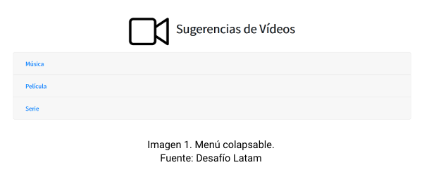
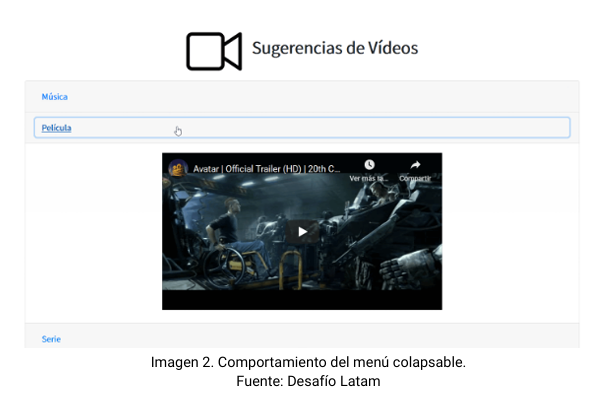
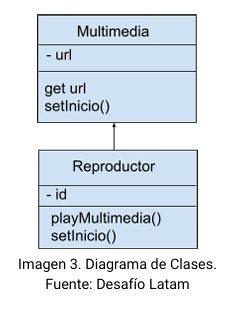

# Desafío - Sugerencia de videos

💡 Realizado [cristiandpto23](https://github.com/cristiandpto23) con HTML, CSS y JS. 
ℹ Front-End G17 - Desafío Latam 
🔗 Desplegado en GitHub Pages [aquí](https://cristiandpto23.github.io/desafio-sugerencia-de-videos/)

## Introducción

En este desafío validaremos nuestros conocimientos de Polimorfismo, Patrón de Módulo.

## Descripción

Un nuevo cliente necesita un sitio web que muestre sugerencias de vídeos, por el momento,  requiere que se muestre una sola sugerencia por categoría, siendo las categorías: Música,  Película y Serie. Estas categorías estarán ubicadas en un menú colapsable, permitiendo  mostrar una categoría a la vez con un solo clic o también ocultar todas las categorías. Por  ende, lo que debe aparecer en cada categoría es un vídeo, puede ser desde cualquier  repositorio en la nube o incrustado de forma local. Pero cada vídeo debe hacer referencia a  la categoría a la cual se hace un click. Como se muestra a continuación:

La url para estos videos será insertada  dinámicamente desde JavaScript implementando clases, polimorfismo, closures y patrón  módulo. Partiendo del siguiente diagrama de clases:

## Requerimientos

1. Implementar el Patrón Módulo mediante IIFE, en donde:

    - Se cree una función privada que reciba la url del video y el id de la etiqueta iframe, para así poder mostrar los videos en el documento HTML.
    - Se retorne una función pública que reciba los parámetros (url, id), y realice el llamado a la función interna (privada) para insertar los elementos recibidos.

2. Establecer una clase padre denominada Multimedia para:

    - Recibir la propiedad url, la cual será el atributo src que necesite la etiqueta iframe para mostrar el video.
    - Proteger el atributo de la clase implementando closures.
    - Agregar un método denominado "setInicio", que retorne el siguiente mensaje: "Este método es para realizar un cambio en la URL del video".

3. Crear una clase "Reproductor", siendo hija de la clase padre Multimedia para:

    - Recibir la propiedad id, la cual será el elemento del DOM que se necesita para poder agregar la URL en la etiqueta que corresponda.
    - Crear un método denominado "playMultimedia", que permita hacer el llamado a la función pública de la IIFE, enviando los atributos url y id.
    - Agregar un método denominado "setInicio", que reciba y agregue tiempo de inicio a la URL de la etiqueta iframe. Se puede utilizar el método "setAttribute" para modificar la URL agregando al final de la misma lo siguiente: "start=${tiempo}". Esto permitirá que cualquiera  de los videos que implemente el método inicie en el tiempo pasado como argumento al método al ser invocado.

4. Instanciar la clase hija pasando como argumento la URL y el id para cada etiqueta iframe, por lo que se deben crear tres instancias, una para música, otra para película y otra para serie, con sus respectivas URL.

5. Invocaral método "playMultimedia" para cada instancia creada, mostrando así los videos en el documento HTML.

6. Utiliza el método "setInicio" para modificar el tiempo de inicio en alguna de las instancias creadas.

## Tecnologías utilizadas

    